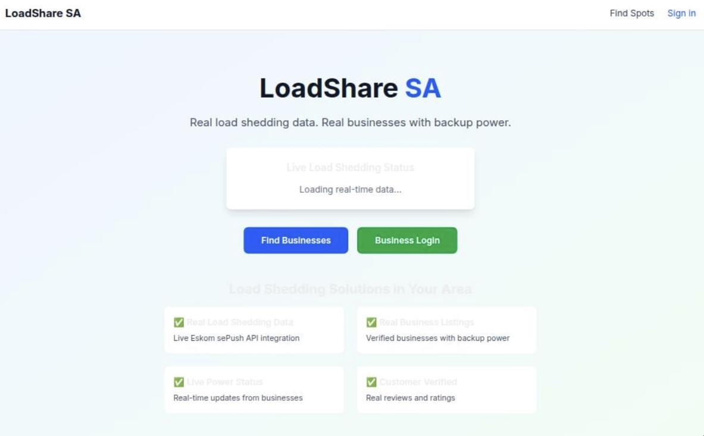
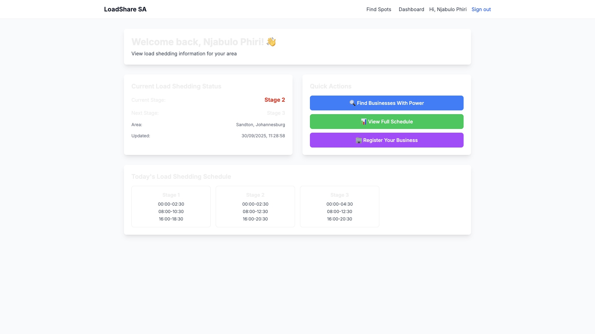
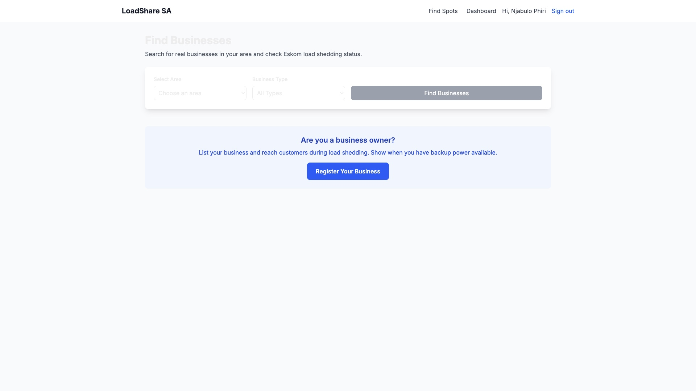

LoadShare SA ⚡

A South African platform that helps users find businesses with backup power during load shedding, and allows business owners to register their establishments to reach more customers.

Live Demo 🚀 

Visit the live application: [https://loadshare-sa.vercel.app](https://loadshare-sa.vercel.app)

Screenshots 📸

1. Homepage


2. Signed In View


3. Business Dashboard & Registration


Features ✨

For Customers:
- 🔍 Search businesses with backup power in your area
- ⚡  Real-time load shedding status integration
- 📱 Mobile-responsive design for on-the-go access
- 🏪 Filter by business type (restaurants, coffee shops, co-working spaces, etc.)

For Business Owners:
- 🏢 Register your business with power backup details
- ✅ Verification system for trusted establishments
- 📊 Dashboard management for your business listings
- 👥 Reach more customers during load shedding periods

Tech Stack 🛠️

- Frontend: Next.js 15, React, TypeScript, Tailwind CSS
- Backend: Next.js API Routes, Prisma ORM
- Database: SQLite (Development) / PostgreSQL (Production-ready)
- Authentication: NextAuth.js with Google OAuth
- Deployment: Vercel
- Styling: Tailwind CSS, Custom Components

Quick Start 🚀

Prerequisites
- Node.js 18+ 
- SQLite (development) or PostgreSQL (production)

Installation

1. Clone the repository
   ```bash
   git clone https://github.com/njabulophiri-dev/loadshare-sa.git
   cd loadshare-sa
2.Install dependencies
    ```bash
   npm install
3.Set up environment variables
     ```bash
     
      touch .env.local 
      //paste the following and configure yours
      # Database (Development - SQLite)
      DATABASE_URL="file:./dev.db"

      # Authentication
      NEXTAUTH_URL="http://localhost:3000"
      NEXTAUTH_SECRET="your_nextauth_secret"
      GOOGLE_CLIENT_ID="your_google_oauth_client_id"
      GOOGLE_CLIENT_SECRET="your_google_oauth_client_secret"

# Eskom API (Optional - uses mock data if not provided)
ESKOM_SEPUSH_API_KEY="your_eskom_api_key"
4.Set up the database

        npx prisma generate
        npx prisma db push
        npm run seed
5.Run the development server

        npm run dev
6.Open your browser of choice:

          Navigate to http://localhost:3000
